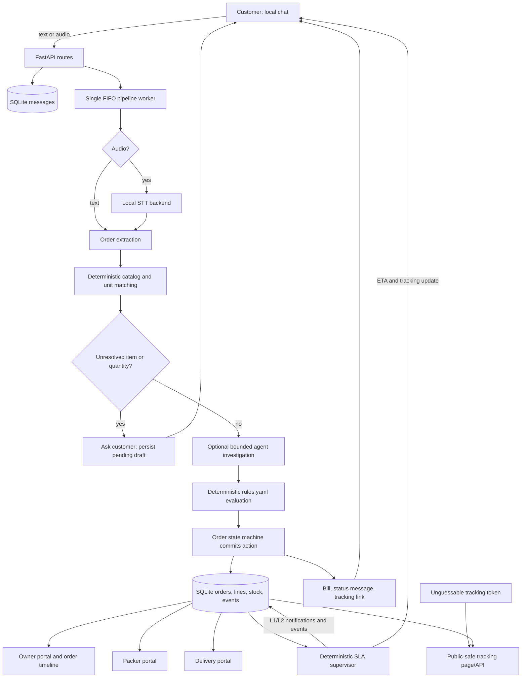

# Munshi

**Munshi is a local AI clerk that turns a small wholesale shop’s customer messages into checked orders, bills, packing work, delivery updates, and an auditable activity log.**

It is designed around a practical boundary: AI can help interpret language and investigate an order, but deterministic shop rules and the order engine control money, stock, approval, billing, and dispatch. If something is unclear or risky, the system asks the customer or the owner instead of silently guessing.

## Why Munshi

Small wholesale and kirana shops coordinate repeat orders across informal channels: typed messages, voice notes, familiar product names, quantities, credit, available stock, packing, and delivery. A conventional order form expects structured input up front; a free-form chatbot can be difficult to audit and unsafe to trust with business decisions.

Munshi combines a familiar chat-like customer page with an explicit operational workflow. It aims to:

- Accept short text orders and audio notes containing Hindi, English, or Hinglish.
- Turn clear messages into catalog-backed line items and ask a short follow-up when an item or quantity is unclear.
- Apply the same visible rulebook to every order, independent of the language model’s suggestion.
- Give the owner and staff role-specific views of active orders and recorded work.
- Provide customers a token-based tracking page without exposing internal order identifiers or shop-account data.
- Keep the application and its AI integrations local by default, with a canned mock mode for reliable demos and tests.

The demo data is fictional and is labelled as such. Munshi is a prototype, not a production-ready commerce or messaging platform.

## What it does

### Customer conversation

- A local chat-style page accepts typed messages and audio uploads.
- The customer can reply to a clarification in the same conversation; an incomplete order can resume rather than starting over.
- Outbound messages include bill/status information and a customer tracking link.
- The demo launcher seeds **one demo customer shop, Ramesh Kirana**, so the customer selector and owner khata stay focused on one store.

### Order and shop operations

- Catalog matching uses item names, aliases, quantity/unit checks, usual-basket context, and conservative fuzzy-match thresholds.
- The owner board groups non-history orders by workflow status and provides the full event timeline, order lines, packing quantities, and customer-view link.
- Credit approval and packing mismatch are explicit owner decisions.
- The packer records quantities. A mismatch blocks dispatch until reviewed; a valid pack moves the order to delivery.
- Delivery staff can start a delivery, mark it delivered, or report a problem for retry.
- The deterministic supervisor watches stage SLAs and records L1/L2 actions. In the prepared delay scene it first nudges the packer, then loops in the owner, reassigns work, and sends the customer an updated ETA and tracking link.

### Tracking and auditability

- `GET /t/{token}` renders a mobile-first, self-contained tracking page with no external assets.
- It shows customer-safe progress, event times, ETA where available, a bill summary, and a delay notice when an L2 attention item is open.
- `GET /api/track/{token}` returns a deliberately narrow payload; it does not return order IDs, staff phones, other customers, credit limits, or account balances.
- Unknown tokens return a friendly 404 page. Tracking pages are marked `noindex` and sent with `Cache-Control: no-store`.
- Pipeline, engine, agent, and supervisor actions are appended to SQLite `events` rows for the owner activity log.

## Architecture



### Technology

| Area | Implementation |
|---|---|
| Runtime | Python 3.11+, one FastAPI/Uvicorn process |
| HTTP/UI | FastAPI, Jinja2 server-rendered shells, vanilla JavaScript, plain CSS |
| Persistence | SQLite via Python’s standard-library `sqlite3`; no ORM |
| Text extraction | Local Ollama model when enabled; schema-validated output with a deterministic typed-text fallback |
| Item matching | Python normalization and `rapidfuzz`; catalog names and aliases |
| Speech-to-text | `mlx-whisper` by default on Apple Silicon, or optional local Ollama audio backend |
| Shop policy | Deterministic Python in `app/rules.py`, configured by `rules.yaml` |
| Tests | pytest and FastAPI `TestClient` |

There is no React build, hosted database, external asset CDN, or cloud API requirement in the default runtime path.

## Order processing in detail

1. **Accept:** `POST /api/customer/{customer_id}/message` stores an inbound text/audio message and queues it. The endpoint acknowledges promptly; the pipeline processes messages on one background worker.
2. **Transcribe (audio only):** Audio is normalized through the local audio helper. Long clips are split into 28-second chunks. The selected local speech backend is tried first; the other real backend can be tried once as fallback.
3. **Extract:** The extractor asks the configured language model for JSON line candidates (`raw`, `item_guess`, `qty`, `unit`) and validates the response with Pydantic. If the model is unavailable or returns unusable output, deterministic parsing is attempted for clear typed orders.
4. **Resolve:** Names and aliases are normalized and ranked with RapidFuzz. A match is accepted at score 88 or higher and with at least an 8-point lead over the runner-up; an unresolved name or missing quantity is sent back for clarification. A mismatch in units is not silently converted.
5. **Investigate (optional agent):** The agent receives a bounded order context and may inspect customer history, search catalog, check stock, resolve a draft line, evaluate rules, and make one final action proposal.
6. **Decide:** The rulebook evaluates known facts: stock, credit, amount limits, new-customer policy, and unusual quantities. The LLM cannot edit the rulebook or commit a decision. A proposal more permissive than the strictest rulebook action is overridden.
7. **Commit:** The order engine validates a legal state transition, reserves/releases stock as appropriate, computes the bill and delivery fee, records events, and queues owner/staff/customer messages.
8. **Fulfil:** Staff record pack counts, dispatch, delivery, or a delivery problem. Invalid state transitions are rejected rather than silently accepted.
9. **Supervise:** A deterministic periodic sweep checks configured SLAs. It writes attention items, notifications, reassignment and customer-delay events. No LLM is involved in delay detection or escalation.

### Agent architecture and trust boundary

```mermaid
sequenceDiagram
    participant P as Pipeline
    participant A as Agent loop (Gemma via Ollama)
    participant T as Validated tools / SQLite context
    participant R as Deterministic rulebook
    participant E as Order engine
    participant O as Owner/customer

    P->>R: Compute baseline from resolved lines, stock, customer and rules
    P->>A: Send compact context and allowed tool schemas
    loop At most 6 model responses
        A->>T: Optional history/catalog/stock inspection
        T-->>A: Bounded results
        A->>T: Optional resolve_line or evaluate_rules
        T-->>A: Validated result and refreshed rulebook verdict
    end
    A->>P: Exactly one proposed action (or fallback)
    P->>R: Enforce strictest deterministic action
    R-->>P: Canonical action and human-readable reasons
    P->>E: Request state transition
    E->>E: Validate transition; write stock/order/event changes
    alt Customer clarification or owner approval required
        E->>O: Ask customer or notify owner
    else Routine order
        E->>O: Send bill/status and tracking link
    end
```

The agent is a **bounded investigator, not an autonomous order-commit service**:

- It has a maximum of six model responses per run and must finish with one `propose_action`; if it fails to do so, the deterministic fallback is used.
- Tool calls are constrained by order state. Catalog and stock tools return facts from local data; line resolution checks catalog membership, unit compatibility, and a minimum match score before updating the working draft.
- The agent’s proposed action is checked against a precomputed rulebook verdict. It cannot make the action less cautious than that verdict.
- Customer-facing agent text is limited in length and checked against numbers present in the order context to reduce invented quantities/prices.
- Failures are recorded as `agent_fallback`/pipeline events where possible; the pipeline still has a polite recovery path.
- In `MUNSHI_MOCK_AI=1`, canned outputs replace actual model calls. The activity log reports fallback honestly; mock mode does not simulate successful tool calls.

### Deterministic rulebook

`rules.yaml` is the editable policy surface. Current defaults include:

| Rule | Current setting |
|---|---:|
| Owner approval if outstanding plus order exceeds credit limit | Enabled |
| Routine auto-confirm amount ceiling | ₹15,000 |
| Unusual quantity prompt threshold | More than 3× usual basket quantity |
| New-customer owner approval | Enabled |
| Partial fulfilment for short stock | Disabled |
| Packing mismatch tolerance | 0 |
| Delivery fee | ₹40 |
| Free delivery threshold | ₹2,000 subtotal |
| Packing / ready pickup / delivery supervision SLAs | 20 / 10 / 45 minutes |
| Escalation gap | 15 minutes |

When more than one policy gate fires, actions are ordered by caution:
`AUTO_CONFIRM < ASK_CUSTOMER < ASK_OWNER < REJECT_SHORT_STOCK`.
Rules and outcomes are plain Python/YAML—not model-generated judgments.

## Local AI models

The AI runtime is optional and local:

| Model/backend | Purpose |
|---|---|
| `gemma4:e4b` through Ollama | Structured order extraction, optional agent tool-calling/proposals, and (if a briefing prompt is present) wording a short briefing |
| `mlx-community/whisper-large-v3-turbo` through `mlx-whisper` | Default audio transcription backend on Apple Silicon |
| `gemma_audio` through Ollama | Optional alternate audio transcription backend |
| `mock` / `MUNSHI_MOCK_AI=1` | Deterministic canned output for UI work, tests, and demos; no model request is made |

The pipeline runs speech transcription before language processing. On a Mac with limited memory, `OLLAMA_MAX_LOADED_MODELS=1` is set by the demo launcher so only one Ollama model is loaded at a time. The `mlx-whisper` import is lazy; environments without it can still run the text path and tests.

## Quick start

### Repeatable, one-store local demo

Requirements: Python 3.11+ and a POSIX shell. Ollama and model downloads are **not** required for mock mode.

```bash
python3 -m venv .venv
source .venv/bin/activate
pip install -r requirements.txt
MUNSHI_MOCK_AI=1 bash scripts/run_demo.sh
```

The launcher:

1. Checks that the selected port is free **before** touching the demo database.
2. Seeds the catalog, staff, and only Ramesh Kirana as the demo customer; synthetic history is labelled `[DEMO HISTORY]`.
3. Primes four live workflow scenes and prints PASS/FAIL.
4. Starts Uvicorn bound to `127.0.0.1` with routine access logs disabled.

Open:

- Customer chat: <http://127.0.0.1:8000/customer/1>
- Owner board: <http://127.0.0.1:8000/owner>
- Packer: <http://127.0.0.1:8000/packer>
- Delivery: <http://127.0.0.1:8000/delivery>

The demo DB defaults to `data/demo.db`, and is reset/reseeded every time the demo launcher is started. Stop an existing server with Ctrl+C before restarting. To use another local port, set `MUNSHI_PORT=8001`; the launcher uses it for the tracking base URL as well.

### Hack-demo sequence

1. In the customer chat, send `2 kg sugar and atta`. Munshi should ask for atta’s missing quantity; reply `1 kg`. Show the resulting bill/tracking button.
2. Open that order in `/owner` and walk through the recorded extraction, rulebook decision, and engine events.
3. Complete the order in `/packer` and `/delivery`. Reopen its tracking page to show **Delivered** and the bill.
4. Show the prepared Scene B approval case in the owner board. The scene temporarily tunes the demo customer’s outstanding balance while making the order, then restores the original balance. Approve it manually.
5. Open the `[DEMO SCENE D]` order and its customer view. Advance the **Skip +10 min** demo clock and run/use the supervisor. Show the L1 nudge, L2 owner/customer escalation and yellow tracking delay banner, then complete the order after reassignment.

The demo scenes and fake data are explicitly labelled in [scripts/demo_setup.py](scripts/demo_setup.py) and [scripts/seed.py](scripts/seed.py).

### Run with local models

Install and start Ollama, pull the configured model, then start the demo without mock mode:

```bash
ollama pull gemma4:e4b
MUNSHI_MOCK_AI=0 bash scripts/run_demo.sh
```

On Apple Silicon, `mlx-whisper` is the default STT backend and may download its model on first use. To use Gemma audio instead, set `MUNSHI_STT_BACKEND=gemma_audio`. If model access fails, the order path has fallback behavior; inspect the owner event timeline for what actually ran.

## Configuration

| Variable | Default | Effect |
|---|---|---|
| `MUNSHI_MOCK_AI` | `0` (demo launcher defaults to `1`) | Use canned AI results; avoids STT/LLM calls |
| `MUNSHI_AGENT` | `1` | Enable the bounded agent loop; `0` uses the deterministic decision path |
| `MUNSHI_LLM_MODEL` | `gemma4:e4b` | Ollama model used for text LLM requests |
| `MUNSHI_LLM_HOST` | `http://localhost:11434` | Ollama HTTP endpoint |
| `MUNSHI_NUM_CTX` | `8192` | Ollama context window |
| `MUNSHI_KEEP_ALIVE` | `10m` | Ollama model keep-alive |
| `MUNSHI_STT_BACKEND` | `mlx_whisper` | `mlx_whisper`, `gemma_audio`, or `mock` |
| `MUNSHI_STT_MODEL` | `mlx-community/whisper-large-v3-turbo` | mlx-whisper model repository |
| `MUNSHI_STT_LANG` | `auto` | Optional requested transcription language |
| `MUNSHI_DB` | `data/munshi.db` | SQLite database path; demo launcher defaults to `data/demo.db` |
| `MUNSHI_PORT` | `8000` | Local demo server port |
| `MUNSHI_BASE_URL` | `http://localhost:8000` | Public base used to construct customer tracking links |
| `MUNSHI_DEMO` | `0` | Enable demo clock and compressed supervisor SLAs |
| `MUNSHI_SCHEDULER` | `1` | Start the daily briefing pre-warm scheduler |

The demo launcher binds only to `127.0.0.1`. Do not expose this unauthenticated prototype through a public tunnel or internet-facing reverse proxy.

## HTTP surface

| Route | Purpose |
|---|---|
| `GET /` | Local role picker |
| `GET /customer/{customer_id}` | Customer chat shell |
| `POST /api/customer/{customer_id}/message` | Accept text and/or audio, enqueue processing |
| `GET /api/state?customer_id=...` | Poll customer messages, orders, and current processing activity |
| `GET /owner` / `GET /api/owner/board` | Owner board shell and grouped active orders |
| `GET /api/owner/order/{order_id}` | Order details and event timeline |
| `POST /api/owner/order/{order_id}/approve` | Owner approval |
| `POST /api/owner/order/{order_id}/decline` | Owner decline |
| `POST /api/owner/order/{order_id}/mismatch` | Resolve a packing mismatch |
| `POST /api/owner/order/{order_id}/reassign` | Reassign a delayed packer |
| `GET /api/owner/khata`, `/stock`, `/rules`, `/notifications`, `/briefing` | Owner operational data |
| `GET /packer`, `GET /delivery` | Staff portal shells |
| `GET /api/tasks/packing`, `GET /api/tasks/delivery` | Current staff task queues |
| `POST /api/tasks/packing/{order_id}` | Submit packed quantities |
| `POST /api/tasks/delivery/{order_id}/start` | Start delivery |
| `POST /api/tasks/delivery/{order_id}/delivered` | Mark delivery complete |
| `POST /api/tasks/delivery/{order_id}/problem` | Report delivery issue |
| `GET /t/{token}`, `GET /api/track/{token}` | Customer-safe tracking page and JSON |
| `POST /api/demo/skip`, `POST /api/supervisor/tick` | Demo clock and explicit supervisor tick |

These routes are for a local prototype. They do not implement authentication, authorization, CSRF protection, or a real WhatsApp integration.

## Data model and workflow states

SQLite is accessed directly with parameterized SQL and foreign-key enforcement. WAL mode and a 5-second busy timeout allow polling reads while the single pipeline worker writes.

Core entities:

- **`customers`**: display/contact fields, credit data, new-customer flag, and usual basket.
- **`items`**: catalog names/aliases, units, prices, and on-hand stock.
- **`orders` / `order_lines`**: lifecycle state, transcript, totals, payment, ETA/tracking token, and item quantities.
- **`messages`**: inbound/outbound customer conversation and optional audio path.
- **`events`**: append-oriented human-readable activity with actor, kind, message, data, and timestamp.
- **`notifications` / `attention_items`**: staff/owner alerts and supervisor escalation state.
- **`staff`**: owner, packer, and delivery roles.

High-level order lifecycle:

```text
NEW
 ├─> CLARIFYING ── customer reply ──> NEW / decision
 ├─> AWAITING_APPROVAL ── owner approve ──> CONFIRMED
 │                         └─ owner decline ──> CANCELLED
 ├─> NEEDS_CUSTOMER_CONFIRM ── confirm ──> CONFIRMED
 ├─> REJECTED
 └─> CONFIRMED ──> PACKING ──> READY_FOR_DELIVERY ──> OUT_FOR_DELIVERY ──> DELIVERED
                        └─> PACK_MISMATCH ── owner recount/partial/cancel
```

The engine has an explicit allow-list of valid transitions. Stock is reserved when an order enters confirmation and returned on cancellation or adjusted to actual packed quantities for allowed partial completion. Credit sales update outstanding at delivery.

## Evaluation and verified metrics

The following are observed project artifacts, **not fabricated product claims**:

| Measurement | Observed value | Scope |
|---|---:|---|
| Automated tests | 126 passed | Last full pytest run after the single-shop demo changes; run again for the current checkout |
| Demo catalog | 30 items | Current CSV seed |
| Demo customer shops | 1 | `scripts/run_demo.sh` uses `--single-shop` |
| Demo staff | 5 | One owner, two packers, two delivery staff |
| Synthetic history | 21 orders | Seed run for the single-shop customer, labelled `[DEMO HISTORY]` |
| Prepared demo scenes | 4 PASS | Auto-confirm, credit approval, packing mismatch, and delayed packing |
| Audio-order evaluation | 6 clips | Existing `eval/report.md`, dated 2026-10-04 |
| Fully correct audio orders | 66.7% | 4 of 6 clips in that small evaluation run |
| Line-item / quantity accuracy | 75.0% / 75.0% | Same 6-clip evaluation; not a broad accuracy claim |
| Mean processing time | 16.2 s/order | Same run and configuration: `mlx_whisper`, `gemma4:e4b`, agent on |
| Safety-net catches | 2 | Same evaluation: wrong extraction did not result in a bill |

The audio evaluation is deliberately small and contains known transcription/extraction errors; it is evidence for iteration, not a statistically representative benchmark. The repository does not claim production throughput, latency SLOs, model accuracy on general traffic, or a measured concurrent-user capacity. The runtime uses one FIFO processing worker and SQLite, so it is aimed at a local single-shop prototype.

To rerun audio evaluation and regenerate `eval/report.md`:

```bash
python scripts/run_eval.py --stt-backend mlx_whisper --llm-model gemma4:e4b --agent on
```

This requires the evaluation audio files, Ollama, and the selected local models. For tests without model downloads:

```bash
MUNSHI_MOCK_AI=1 python -m pytest -q
```

## Repository map

```text
app/
  main.py             FastAPI pages and HTTP endpoints
  db.py               SQLite schema, migration helpers, table access
  pipeline.py         Queued message processing and orchestration
  ai/
    audio.py          Local audio normalization/chunking helpers
    stt.py            Local speech-to-text backends and fallback
    extract.py        Structured extraction, catalog matching, typed fallback
    llm.py            Ollama HTTP client and mock outputs
    briefing.py       SQL-derived facts and optional summary wording
  agent.py            Bounded investigation loop and proposal validation
  rules.py            Deterministic decision gates
  engine.py           State machine, stock, billing events, fulfilment actions
  supervisor.py       Deterministic SLA scan and escalation
  bill.py             Bill construction
  messages.py         Customer/staff message templates
  tracking.py         Token URLs and privacy-limited tracking payload
  owner.py            Owner board, order log, khata, stock and settings queries
  templates/          Jinja2 pages
  static/             Plain CSS and vanilla JavaScript
scripts/
  run_demo.sh          Safe localhost demo launcher
  seed.py              Master data and labelled synthetic history
  reset_demo.py        Reset transactional data and restore CSV snapshots
  demo_setup.py        Four deterministic, labelled demo scenarios
  run_eval.py          Audio evaluation harness
data/
  catalog.csv          Fictional demo catalog
  customers.csv        Fictional demo customer data
  staff.csv            Fictional demo staff data
prompts/               Extraction, agent, and briefing prompt text
eval/                   Audio fixtures, expected orders, and evaluation output
tests/                  Unit and FastAPI integration tests
rules.yaml              Editable deterministic shop policy
```

## Development and checks

```bash
python3 -m venv .venv
source .venv/bin/activate
pip install -r requirements.txt
MUNSHI_MOCK_AI=1 python -m pytest -q
```

Useful targeted commands:

```bash
python -m pytest -q tests/test_pipeline.py tests/test_tracking.py
python -m pytest -q tests/test_owner.py tests/test_supervisor.py
MUNSHI_MOCK_AI=1 bash scripts/run_demo.sh
```

The seed/reset scripts are destructive to the selected database: they clear its demo/order tables and rebuild or restore demo data. Use an isolated `MUNSHI_DB` path when experimenting; never point them at data you need to keep.

## Limitations and safety

- **No authentication or authorization:** anyone who can reach the process can access owner and staff functions. Keep it on localhost; this is not safe to expose to a network.
- **No real messaging integration:** the customer portal simulates a chat UI; it does not send WhatsApp/SMS messages.
- **Fictional demo data:** seeded customers, phone numbers, staff, and synthetic history are for local testing only.
- **No cloud inference by default:** configured AI calls target local Ollama; do not change `MUNSHI_LLM_HOST` to a remote host unless you have intentionally reviewed the data/privacy consequences.
- **Single worker and SQLite:** message processing is serialized and staff task lists are pooled. This is intentionally simple and not designed for multi-process scale or high concurrency.
- **Speech recognition can be wrong:** catalog matching, clarification, approval gates, packing mismatch, and event history mitigate mistakes but do not eliminate them.
- **Audio retention:** uploaded audio is stored in `data/uploads/`; automatic retention/cleanup is not implemented.
- **Not accounting software:** credit and bill logic is a prototype and should not replace a shop’s audited financial system.

## License

No license file is currently documented here. Add the project’s chosen license before redistributing it as an open-source package.
